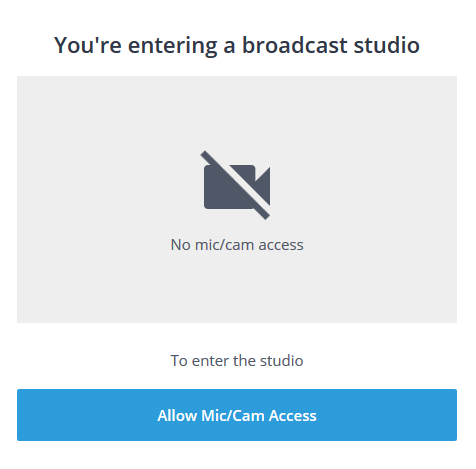
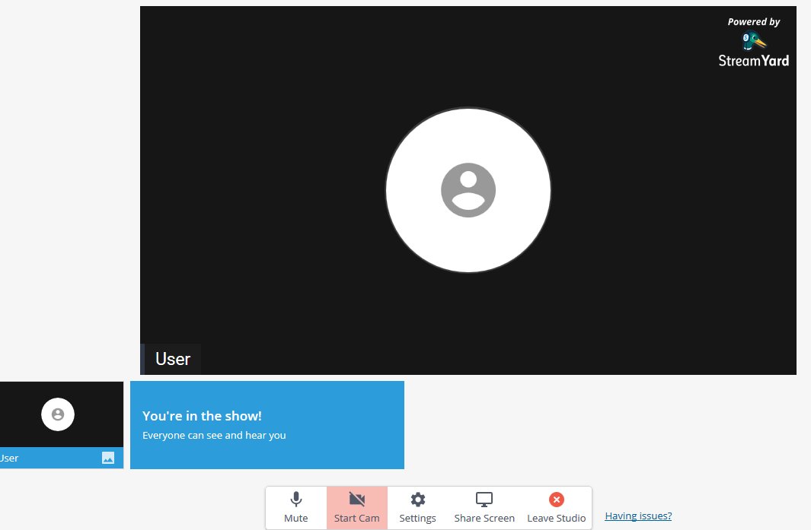

+++
title = "Как задать вопрос или высказаться"
type = "system"
+++

При желании задать вопрос докладчику в текстовом виде это можно сделать во время
прослушивания доклада и далее, во время проведения круглого стола по обсуждению
данного доклада в [чате Telegram](https://t.me/mera_kob) или
[WhatsApp](https://chat.whatsapp.com/invite/L3g8nbBY6dRBA3pDEPnq2j).

При желании высказаться по теме доклада в аудио или видео формате необходимо
отправить сообщение «Я хочу высказаться (только голос)» или «Я хочу высказаться»
в любой из чатов или на почту pkforum@m3ra.ru. В ответ на это вам в личку или на
почту будет выслана ссылка для подключения к сервису трансляции (вида
https://streamyard.com/link), при переходе по ней вы увидите сообщение вида:

Для продолжения нужно будет нажать кнопку «Allow Mic/Cam Access». Далее во
всплывающем окне с обнаруженными данными о вашей камере и микрофоне нужно будет
нажать кнопку «Разрешаю».

Далее появится форма для проверки работы камеры и микрофона, там вы увидите как
будете выглядеть в трансляции и проверить уровень своего звука. На последнем
шаге необходимо будет внести своё имя в поле «Display Name» и нажать кнопку
«Enter Broadcast Studio».

Вы увидите окно ожидания подключения к стриму:

Как только модератор даст вам слово в порядке очереди желающих высказаться, вы
увидите себя в окне трансляции (или только своё имя, если камеры у вас нет или
доступ к ней не был дан во время настроек на предъидущих шагах) и сможете
сказать всё, что хотели.

Когда диалог с докладчиком будет закончен и модератор даст слово следующему
желающему, необходимо будет нажать кнопку «Leave Studio» и продолжить
отслеживать происходящее в трансляции через YouTube.
